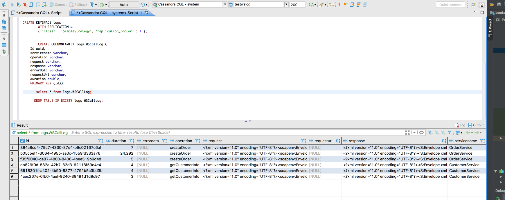

# SOAP Web Service Call Log to Cassandra
Spring Boot JaxWS web service deployind and web service call logging to cassandra. 
Code written by bottom-up web service design. 

## Local Services: 
http://localhost:8080/services/OrderWebService?wsdl

http://localhost:8080/services/CustomerWebService?wsdl

### Cassandra data after WS call: 

  

